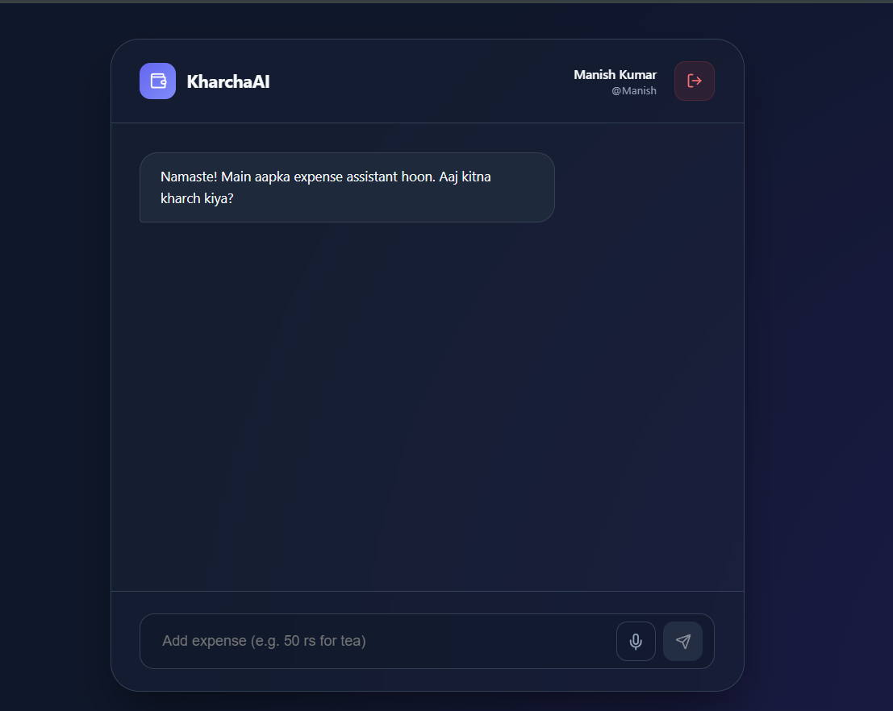

# KharchaAi 💸🤖
**Your Smart Hinglish AI Expense sidekick.**

KharchaAi is a modern, AI-powered expense tracker designed for the Indian user. It understands your Hinglish voice, organizes your kharcha automatically, and shows you beautiful insights—all while being perfectly centered and premium.

## ✨ Key Features
- **🎤 Hinglish Voice Input**: Type or say "Add 50 rs for tea" or "Aaj kitna kharch kiya?". It understands everything!
- **📊 Smart Aggregations**: Get instant summaries for today, this month, or by category.
- **🛡️ Secure Persistence**: Powered by Supabase with Row Level Security (RLS). Your data is yours alone.
- **✨ Premium UI**: Fully centered, glassmorphic design with pulse animations and high-contrast visuals.
- **🚀 Advanced AI**: Uses Sarvam AI (sarvam-m) for complex intent recognition (Add, Update, Delete, Query).

## 🛠️ Tech Stack
- **Frontend**: React (Vite), Lucide-React for icons, Vanilla CSS (Premium Glassmorphism).
- **Backend**: Node.js, Express, MCP Service.
- **Database**: Supabase (PostgreSQL).
- **AI Engine**: Sarvam.ai completions.
- **Bridge**: Python MCP Server for secure database transactions.

## 🚀 Getting Started

### 1. Requirements
- Node.js (v18+)
- Conda or Python 3.10
- Supabase Account
- Sarvam AI API Key

### 2. Setup
1. Clone the repo:
   ```bash
   git clone https://github.com/your-username/kharcha-ai.git
   cd kharcha-ai
   ```
2. Install Frontend dependencies:
   ```bash
   cd frontend && npm install
   ```
3. Install Backend dependencies:
   ```bash
   cd ../backend && npm install
   ```
4. Configure Environment Variables (`.env`):
   - `SUPABASE_URL`
   - `SUPABASE_ANON_KEY`
   - `SARVAM_API_KEY`
   - `PORT=5001`

5. Run the magic 🪄:
   ```bash
   # Terminal 1: Frontend
   npm run dev
   
   # Terminal 2: Backend
   npm run start
   ```

## 📸 Screenshots


---
Made by - Lucky Chauhan. 🛋️🚀🔍✨
