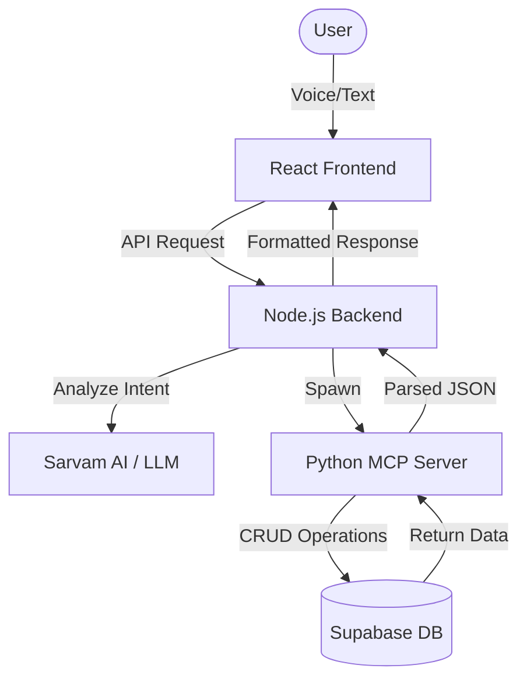

<div align="center">
  <h1>💸 KharchaAI</h1>
  <p><strong>Your Smart Hinglish AI Expense sidekick.</strong></p>

  [](https://vitejs.dev/)
  [](https://reactjs.org/)
  [](https://nodejs.org/)
  [](https://supabase.com/)
  [](https://vercel.com/)

  <p>
    <a href="https://kharcha-ai-wheat.vercel.app/"><strong>Explore Live Demo »</strong></a>
    <br />
    <a href="https://github.com/LuckyChauhan18/KharchaAI">View Repository</a>
  </p>
</div>

---

### 🌟 Overview
**KharchaAI** is a modern, AI-powered expense tracker designed specifically for the Indian user. It understands **Hinglish** voice/text, organizes your *kharcha* automatically, and provides beautiful visual insights—all wrapped in a premium, glassmorphic UI.

### ✨ Key Features
- **🎤 Hinglish AI Engine**: Say *"Add 50 rs for tea"* or *"Aaj kitna kharch kiya?"*. It understands context, amounts, and categories instantly.
- **📊 Interactive Dashboard**: Vibrant charts and graphs (Pie/Bar) powered by Chart.js for deep spending analytics.
- **🕒 Real-time Chat**: A premium chat interface with typing animations and instant database syncing.
- **🛡️ Enterprise Security**: Built on Supabase with Row Level Security (RLS) and JWT authentication.
- **📥 One-Click Export**: Export your entire expense history to a clean CSV file for offline tracking.

---

### 🏗️ Architecture


---

### 🛠️ Tech Stack
| Category | Technology |
| :--- | :--- |
| **Frontend** | React, Vite, Chart.js, Lucide Icons, Vanilla CSS |
| **Backend** | Node.js, Express, MCP Architecture |
| **Database** | Supabase (PostgreSQL) |
| **AI/ML** | Sarvam.ai completions, Hinglish Intent Parsing |
| **Language** | Javascript, Python, SQL |

---

### 🚀 Getting Started

#### 1. Requirements
- Node.js (v18+)
- Conda or Python 3.10
- Supabase Account & Sarvam AI API Key

#### 2. Development Setup
```bash
# Clone the repository
git clone https://github.com/your-username/kharcha-ai.git
cd kharcha-ai

# Setup Frontend
cd frontend && npm install
npm run dev

# Setup Backend
cd ../backend && npm install
# Configure your .env (SUPABASE_URL, SUPABASE_ANON_KEY, SARVAM_API_KEY)
npm start
```

---

### 📸 Preview
<div align="center">
  
</div>

---

<div align="center">
  <p>Made with ❤️ by <strong>Lucky Chauhan</strong></p>
  <p>Built for the modern Indian spender. 🇮🇳🚀</p>
  <p>
    <a href="https://kharcha-ai-wheat.vercel.app/">Live Demo</a> •
    <a href="https://github.com/LuckyChauhan18/KharchaAI">View Code</a>
  </p>
</div>
