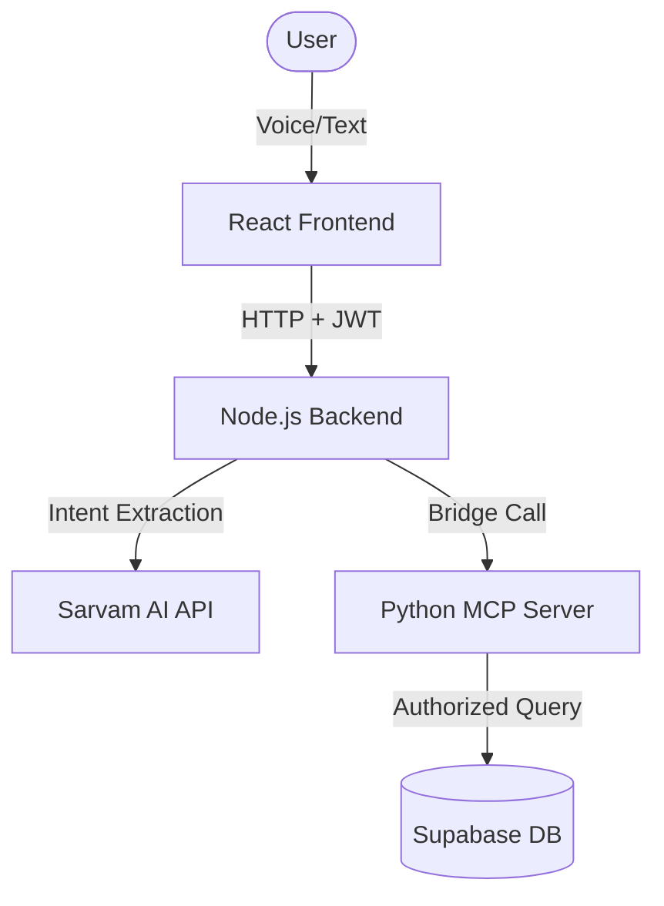

# KharchaAi: System Flow & Function Explanation 🧠⚡

This document explains how **KharchaAi** processes your voice and text to manage expenses securely.

## 🏗️ Architecture Overview

KharchaAi uses a **Bridge Architecture** to combine the power of Node.js (Web Server) with Python (Data & AI Protocol).

---

## 🔄 The Lifecycle of a Request
*Example: "Add 50 rs for tea"*

1.  **Frontend (React)**: 
    - `handleSend(text)`: Captures input and sends a POST request to `/api/chat` with your unique Authorization Token (JWT).
2.  **Backend (Middleware)**:
    - `authMiddleware.js`: Validates your token and attaches your `user_id` and raw `token` to the request object.
3.  **AI Extraction**:
    - `extractExpenseWithAI(text)`: Uses **Sarvam AI** with a specialized system prompt to detect if you want to **ADD**, **DELETE**, or **QUERY**. It extracts the amount (50) and category (tea).
4.  **Routing**:
    - `chatController.js`: Receives the "ADD" intent and calls the `add_expense` tool via the MCP service.
5.  **The Bridge (MCP)**:
    - `callMcpTool(toolName, args)`: Spawns a temporary Python process. It passes all data + your **JWT Token** to the Python script.
6.  **Database Action (Python)**:
    - `set_auth(token)`: The most critical part. It tells Supabase, *"I am acting on behalf of this specific user."*
    - `add_expense()`: Performs the `INSERT` into the `expenses` table.
7.  **Response**: The success message travels back through the chain and shows up in your bubble!

---

## 🛠️ Key Function Definitions

### Frontend
- **`startVoiceInput()`**: Uses the Web Speech API (`en-IN`) to convert your speech into Hinglish text.
- **`ExpenseTable({ data })`**: A premium React component that renders rows for each transaction with glassmorphic styles.

### Backend (Node.js)
- **`extractExpenseWithAI(text)`**: The "Brain." It handles the logic for distinguishing between "Total expense" (Query) and "Add 100" (Insert).
- **`callMcpTool(toolName, args)`**: The "Messenger." It ensures Python and Node can talk to each other without losing your security context.

### Database (Python)
- **`set_auth(access_token)`**: **Crucial.** It bypasses Row Level Security (RLS) by proving to Supabase that the request is authenticated.
- **`get_summary(period)`**: Calculates totals on the fly using SQL filters for `today`, `month`, or `total`.
- **`delete_expense()`**: Uses `ilike` matching so that saying "Remove tea" matches "Chai/Tea" descriptions.

---

## 🐳 Why Docker?
The **Dockerfile** setup ensures that when you move to AWS, the **Node.js environment** and **Python environment** are perfectly synced. No "it works on my machine" bugs!

---
Built with ❤️ by Antigravity AI for Lucky. 🛋️🚀🔍✨
